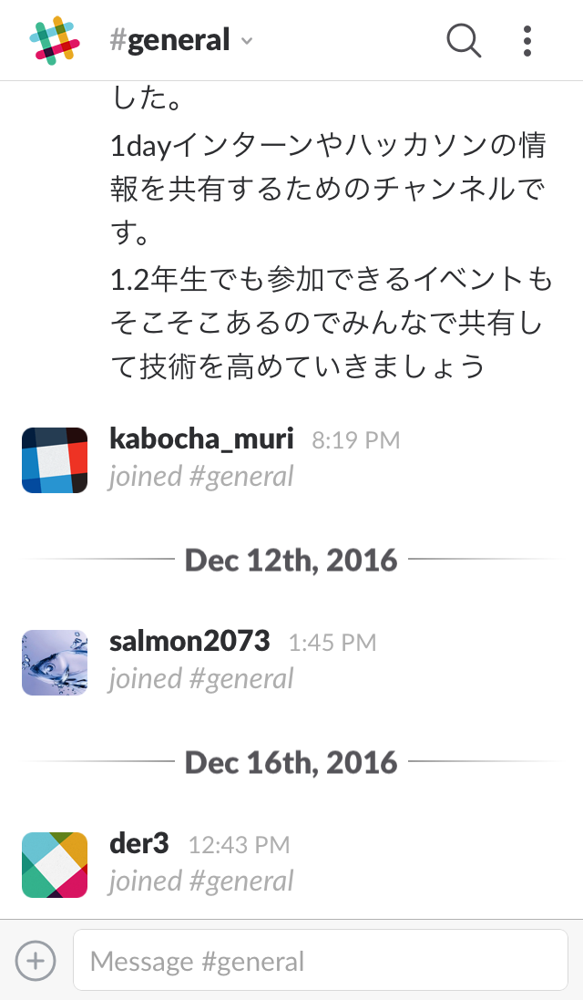
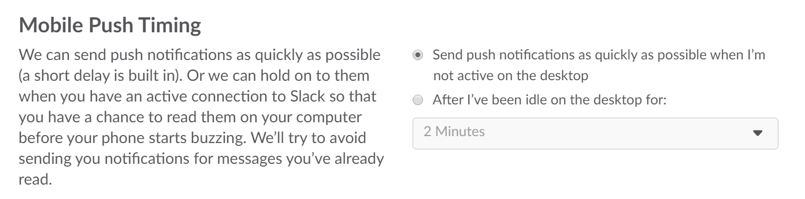
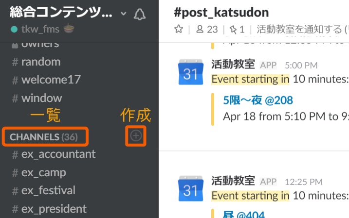
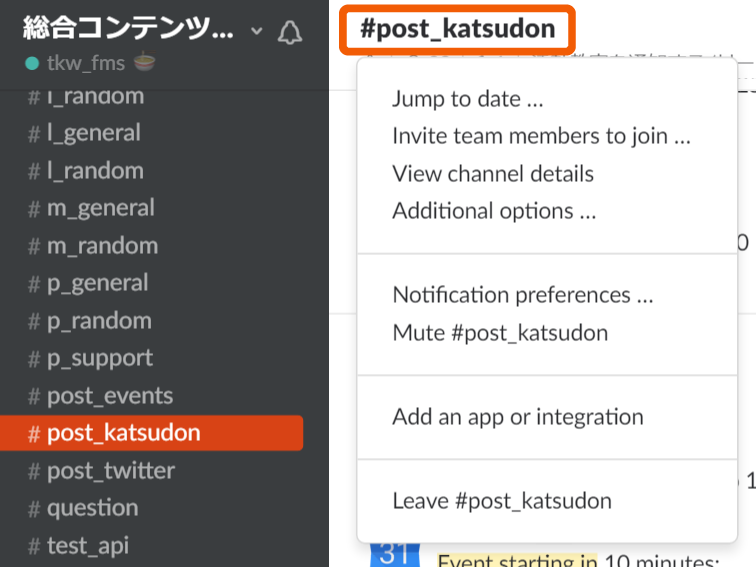
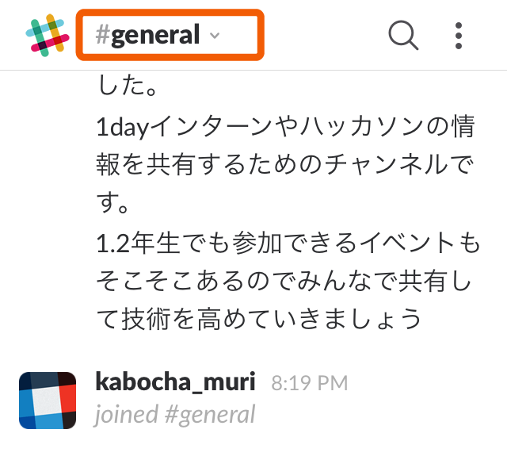

<!-- $theme: gaia -->
<!-- $size: 16:9 -->

<!-- *template: invert -->

## 資料はこちら

# https://goo.gl/BwkObP
##### `マニュアル` の方を開いてお待ちください

---
<!-- page_number: true -->
<!-- footer: 総合コンテンツ制作サークル-->

# ==Slack講習会==
#### Slackの導入と使い方
###### 2017/4/21 Updated by Tokiwa

---

<!-- *template: invert -->

# 目次
#### ==＜よくありそうな質問＞==
1. Slackとは
2. Slackの利用用途
3. なぜSlackを使うのか
#### ==＜導入＞==
4. **4つの大事な作業**

---

<!-- *template: invert -->

# 目次
#### ==＜使い方＞==
5. 画面の見方と用語
6. 通知について
7. 特徴的な機能
8. 公式チャンネル

---

# 1. [Slack](https://slack.com/)とは

- ビジネス向けの**グループ機能に特化**したチャットサービス
- ブラウザ、PC、モバイル版がある
- FMSの一部研究室で利用されている
- 残念ながらUIは**英語**

---

# 2. Slackの利用用途

- 総会や発表会など **全体に向けた連絡**
- 班会や講座など **班ごとの連絡**
- 活動教室や講座など **イベントの告知**
- 知見共有
- メンバーとの交流・雑談

---

# 3. なぜSlackを使うのか

###  LINEの場合
- 通知がON/OFFしか選べないので発言しづらい
- グループ作成が面倒

###  Slackの場合
- 簡単にグループが作れ、簡単に参加できる
- 通知を細かく設定できるので発言しやすい

---

<!-- *template: gaia -->

# 4. 4つの大事な作業
##### ここから皆さんに4つの作業をしてもらいます
##### スマホとPCを用意してください

---

## ==① Slackに参加==

- **入会時に登録したメールアドレス**に招待メールを送信しました
- ログインに必要なので覚えておいてください

### 手順

1. 届いたメールの `Join Team` をクリック

---

2. 名前(漢字)とユーザー名を入力

---

3. パスワードを作成 (**忘れないように！**)

---

4. 利用規約に同意

---

### 参加完了！
##### Slackの画面が開いたら==ひとまずそのまま==で！

---

## ==② Slackアプリのインストール==

- **【必須】モバイル(スマホ)版**
- 【推奨】ブラウザ、デスクトップ版
    - スマホがない人はこのどちらかを入れてください

---

### モバイル版の導入

###### DEMO

---

### ログイン成功！

### 

---

## ==③ 参加チャンネルの確認と通知設定==

- 確実に重要なメッセージが通知されるために、絶対設定してください
- 運営側で個人の通知設定を変更することはできません
- 通知設定には**Slack側の設定**と**スマホ側の設定**があります

---

### チャンネルの確認

- 左メニューの `CHANNELS` に 次のチャンネルがあるか確認する

|||
|:--|:--|
|||

---
- #general
- #random
- #question
- #works
- 班ごとのチャンネル
	- **音楽班**: #**==m==**_general #**==m==**_random
	- **プログラミング班**: #**==p==**_general #**==p==**_random
	- **映像班**: #**==v==**_general #**==v==**_random
	- **イラスト班**: #**==i==**_general #**==i==**_random
	- **文芸班**: #**==l==**_general #**==l==**_random

---

### PC版の通知設定
###### DEMO

---

### モバイル版の通知設定
###### (※ PCで設定した方は不要)
###### DEMO

---

#### 同様に `#m_general` といった班ごとのチャンネルも通知ONに！
###### 詳しくは後で話します

---

### モバイル通知のタイミング

- 既定ではPCでログインしているとモバイルに通知が来るのが2分後
- すぐ通知がくるように変更する

---

### 通知の確認
#### 今から `#general` にテストメッセージを送信します
###### スマートフォンに通知が来ているか確認してください

---

## ==④ プロフィールの設定==

#### 左メニュー `slackbot` にプロフィールを送信します
###### DEMO

---

## ==④ プロフィールの設定==

### PC版
###### DEMO

---

## ==④ プロフィールの設定==

### モバイル版
###### DEMO

---

### プロフィールの設定

- `What I Do` にはルールがあります

#### What I Do (Role) の例
> FMS1年 総コンくん | 幹事長 プログラミング班`*1` | @CCC_sokon`*2`

`*1`: 第一所属班、サブ所属班の順に記入されています
`*2`: TwitterのID (任意)

---

<!-- *template: gaia -->

# ご協力ありがとうございました

---

<!-- *template: invert -->

# ここからSlackの使い方を学びます
##### Slackにはたくさんの機能があります ですが==全てを使いこなす必要はありません==

---

# 5. 画面の見方と用語

---

## チャンネルとは

- グループの一種
- Slackは `チーム`という枠の中に `チャンネル` というグループがある
	- みなさんは総コンというチームに所属している
- 重要事項を流すもの、雑談、班別など目的別に分かれている
- **誰でも閲覧、参加が可能である** (参加資格のあるものを除く)
	- プライベートなチャンネルも作成可能
- `#name` でチャンネルへのリンクが貼れる
- チャンネル紹介は後ほど

---

### チャンネルの参加・作成方法

- 左メニュー `CHANNELS` から一覧、`+`から作成

- チャンネルの作成にはルールがあります (後述)

---

### チャンネルのメニュー

- 上部チャンネル名をクリック

| | |
|:--|:--|
|  |  |

---

### メニュー解説 (PC版)

- `Invite team members to join ...` : メンバーを招待する
- `View channel details`: チャンネルの用途、ピン止めしたアイテムなど
- `Notification preferences ...`: 通知設定
- `Mute #channel`: チャンネルをミュートする
- `Leave #channel`: チャンネルを抜ける

---

## DM(ダイレクトメッセージ) とは

- 個人チャットのこと
- メッセージは2人だけで共有され、管理者ですら見えない
- 同じチーム内ではどのユーザーにもDMが送れる
	- LINEの "友だち" の概念はない
- 自分自身にDMを送ることでメモとして使える

---

### DMの見方
- 左メニュー `DIRECT MESSAGES` にこのチームに参加しているユーザーの一部が表示される
- 全てのユーザーを見るときは `DIRECT MESSAGES` をクリック

---

# 5. 通知について

---

## 通知

- Slackでは ==初期設定が通知しない設定== である
	- つまり基本的にはメッセージを送っても気づかれにくい
- 大事な要件を送りたいときには**送信側の配慮、受信側の設定**によって通知が来たり来なかったりするので注意
- 逆に言えば話が盛り上がってメッセージが増えたとしても、メンバーのスマホの通知領域の心配をする必要はない

---

## メンションと特殊記法

- Twitterと同じように `@username` で特定の人に返信できる
- これを使うと、相手に通知がいくようになる
	- 相手がミュート設定の場合届かない
- `@channel` でそのチャンネルの参加者全員に通知
- `@here` でそのチャンネルでオンラインの人だけに通知

---

## 通知設定の種類

- `Activity of any kind`
	- 全て通知する
- `Mentions of my name or highlight words`
	- 自分宛のメンションとハイライト単語のみ **(初期設定)**
- `Nothing`
	- なし 

---

- 通知設定はチャンネルごと、｢4つの大事な作業｣の手順と同様

---

# 7. 特徴的な機能

---

### リアクション

- TwitterのLike(ファボ)の拡張版
	- 多くの絵文字が使える 
- 全てのメッセージにリアクションがつけられる
- 既読・了解の確認やアンケートとして使える
- Twitterと違い、通知はいかない

---

### リアクションのしかた
- ==**general**== がつくチャンネルの連絡には必ずリアクションをしましょう

---

### リアクションをしてみよう！ :+1:

###### DEMO

---

### スレッド

- 2chのスレと同様にスレを立てられる
- 全てのメッセージからスレッドが作成できる
- スレッド内の通知はチャンネル同様 `@username` でメンション
	- 他の人をスレッドに呼びたい場合も同様

#### 活用方法
- 複数の会話が同じチャンネルで飛び交うとき
- 通知必須のチャンネルで特定の人だけにリプライしたいとき

---

### スレッドの立て方

- スレッドを活用して可読性を高めよう！

- スレッドがある場合このように表示される

---

### スレッドで `@sokon` を呼んでみよう！
###### DEMO

---
<!-- *template: invert -->

### Slackには他にも機能がたくさん
##### ファイル共有、ピン、スニペット、ポスト、外部連携、BOT etc...

---

# 8. 公式チャンネル

---

### チャンネルごとの設定について

- チャンネルによっては参加必須など条件のついたものがあります
	- **特に通知必須のチャンネルでの発言には注意しましょう**
- チャンネルは目的別です チャンネルの趣旨とは関係のないチャットはご遠慮ください

#### 設定の確認方法
- **==[公式チャンネル一覧]()==**
- Slack上で `Channel Details` から

---

### どんなチャンネルがあるか見てみよう！
###### DEMO

---

### チャンネルの作成について

- 誰もがチャンネルを作成することができます
- ただルールがあり ==[Slack利用規約]()== に従ってください
- ｢総コンに関すること｣である必要はありません
	- 例: `#foods`: おいしいお店共有
- チャンネルを作ったら `#random` でつぶやこう！

---

<!-- template: gaia -->

# 以上で解説は終わりです
#### Slackは堅苦しくありません！ **活動教室のような場** と思ってください
#### 分からないことがあれば `#question` か役職者に聞いてみよう！