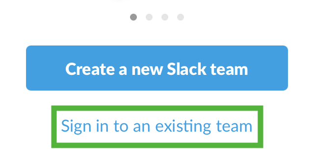
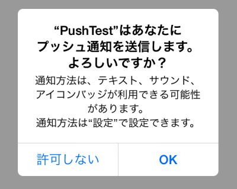
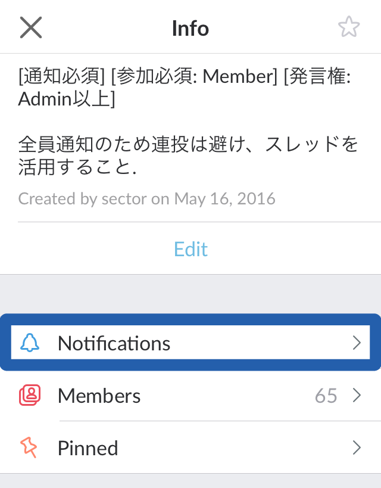
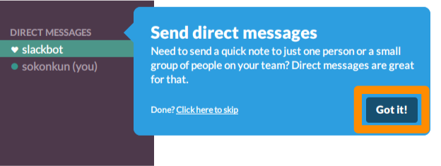

<!-- $theme: gaia -->
<!-- $size: 16:9 -->
<!-- page_number: true -->
<!-- footer: 総合コンテンツ制作サークル-->

# Sokon Slack
### ==Instruction & Agreement==
###### (C) 2017 Tokiwa

---

<!-- *template: invert -->

# 目次
#### ==＜よくありそうな質問＞==
1. Slackとは
2. Slackの利用用途
3. なぜSlackを使うのか
#### ==＜導入＞==
4. **4つの大事な作業**

---

<!-- *template: invert -->

# 目次
#### ==＜使い方＞==
5. 画面の見方と用語
6. 通知について
7. 特徴的な機能
8. 公式チャンネル

---

# 1. [Slack](https://slack.com/)とは

- ビジネス向けの**グループ機能に特化**したチャットサービス
- ブラウザ、PC、モバイル版がある
- FMSの一部研究室で利用されている
- 残念ながらUIは**英語**

---

# 2. Slackの利用用途

- 総会や発表会など **全体に向けた連絡**
- 班会や講座など **班ごとの連絡**
- 活動教室や講座など **イベントの告知**
- 知見共有
- メンバーとの交流・雑談

---

# 3. なぜSlackを使うのか

###  LINEの場合
- 通知がON/OFFしか選べないので発言しづらい
- グループ作成が面倒

###  Slackの場合
- 簡単にグループが作れ、簡単に参加できる
- 通知を細かく設定できるので発言しやすい

---

<!-- *template: gaia -->

# 4. 4つの大事な作業
##### ここから皆さんに4つの作業をしてもらいます
##### スマホとPCを用意してください

---

## ==① Slackに参加==

- 今から**入会時に登録したメールアドレス**に招待メールを送信します
	- メールアドレスを忘れてしまった方はTAを呼んでください

### 手順
1. 届いたメールの `Join Team` をクリック
2. 名前(漢字)とユーザー名(ID)を入力

---

---

3. パスワードを作成 (**忘れないように！**)

---

4. 利用規約に同意

---

### 参加完了！
##### Slackの画面が開いたら==ひとまずそのまま==で！

---

## ==② Slackアプリのインストール==

#### **[ダウンロード](https://slack.com/downloads)**

- **【必須】モバイル(スマホ)版**
- 【推奨】ブラウザ、デスクトップ版
	- ブラウザ版は[ここ](https://sokon.slack.com)を開くだけで見られます
	- Chromeの場合、タブを右クリックで`タブを固定`すると便利
	(通知も受け取れる)
    - スマホがない人はこのどちらかを入れてください

---

### モバイル版の初期設定

1. アプリをインストール ( `slack`で検索 )

---

2. `Sign in to an existing team` をタップ

---

3. `sokon` と入力

---

4. 招待が来たメールアドレスを入力

---

5. `Type password` をタップ

---

6. パスワードを入力

---

### ログイン成功！

---

## ==③ 参加チャンネルの確認と通知設定==

- 確実に重要なメッセージが通知されるために、絶対設定してください
- 運営側で個人の通知設定を変更することはできません
- 通知設定には**Slack側の設定**と**スマホ側の設定**があります

---

### スマートフォン側の設定

- このようなポップアップが出たら `許可` や `OK` をタップ

| iPhoneの例 | Androidの例 |
|:-:|:-:|
| |  |

---

### Slack側の設定

---

#### PC版

1. 左メニューに 次のチャンネルがあるか確認する

---
- #general
- #random
- #question
- #works
- #m_general #m_random など
	- 冒頭の文字は所属班によって異なる
		###### `m_`: 音楽班
		###### `v_`: 映像班
		###### `p_`: プログラミング班
		###### `i_`: イラスト班
		###### `l_`: 文芸班

---

#### PC版

2. 上部の `#general` から `Notification preferences …` をクリック

---

#### PC版

3. `Desktop notifications`, `Mobile push notifications` の両方を
`Activity of any kind` にする

---

#### モバイル版 (※ PCで設定した方は不要)

1. 左にスワイプして `#general` をタップ

---

#### モバイル版

2. 上の `#general` をタップ

---

#### モバイル版

3. `Notifications` をタップ

---

#### モバイル版

4. `All Activity` をタップ

---

#### 同様に `#m_general` といった班ごとのチャンネルも通知ONに！
###### 詳しくは後で話します

---

## ==④ プロフィールの確認==

#### PC版

1. 左上の `総合コンテンツ… ∨` から `Profile & account` をクリック

---

#### PC版

2. 右メニューにプロフィールが表示されるので、
`Edit Profile` をクリック

---

#### モバイル版

1. 右にスワイプして `Edit Profile` をタップ

---

## ==④ プロフィールの確認==

- プロフィールが正しいか確認してください
- 氏名・What I Doは変更禁止 あとは自由

<<<<<<< HEAD
`First Name`: 名前 (漢字)
`Last Name`: 苗字 (漢字)
※ モバイル版では上が `First` 下が `Last`
=======
#### What I Do (Role) の例
> FMS1年 総コンくん | 幹事長 プログラミング班`*1` | @CCC_sokon`*2`
>>>>>>> origin/master

`*1`: 第一所属班、サブ所属班の順に記入されています
`*2`: TwitterのID (任意)

---

<!-- *template: gaia -->

# ご協力ありがとうございました

---

<!-- *template: invert -->

# ここからSlackの使い方を学びます
##### ==しかし全ての機能を使いこなす必要はありません==

---

# 5. 画面の見方と用語

---

## チャンネルとは

- グループの一種
- Slackは `チーム`という枠の中に `チャンネル` というグループがある
	- みなさんは総コンというチームに所属している
- 重要事項を流すもの、雑談、班別など目的別に分かれている
- **誰でも閲覧、参加が可能である** (参加資格のあるものを除く)
- `#name` でチャンネルへのリンクが貼れる
- チャンネル紹介は後ほど

---

### チャンネルの見方
- 左メニュー `CHANNELS`に参加しているチャンネル一覧

---

### チャンネルの参加・作成方法

- 左メニュー `CHANNELS` から一覧、`+`から作成

- チャンネルの作成にはルールがあります (後述)

---

### チャンネルのメニュー

- 上部チャンネル名をクリック`

---

#### モバイル版

---

### メニュー解説 (PC版)

- `Invite team members to join ...` : メンバーを招待する
- `View channel details`: チャンネルの用途、ピン止めしたアイテムなど
- `Notification preferences ...`: 通知設定
- `Mute #channel`: チャンネルをミュートする
- `Leave #channel`: チャンネルを抜ける

---

## DM(ダイレクトメッセージ) とは

- 個人チャットのこと
- メッセージは2人だけで共有され、管理者ですら見えない
- 同じチーム内ではどのユーザーにもDMが送れる
	- LINEの "友だち" の概念はない
- 自分自身にDMを送ることでメモとして使える

---

### DMの見方
- 左メニュー `DIRECT MESSAGES` にこのチームに参加しているユーザーの一部が表示される
- 全てのユーザーを見るときは `DIRECT MESSAGES` をクリック

---

# 5. 通知について

---

## 通知

- Slackでは ==初期設定が通知しない設定== である
	- つまり基本的にはメッセージを送っても気づかれにくい
- 大事な要件を送りたいときには**送信側の配慮、受信側の設定**によって通知が来たり来なかったりするので注意
- 逆に言えば話が盛り上がってメッセージが増えたとしても、メンバーのスマホの通知領域の心配をする必要はない

---

## メンションと特殊記法

- Twitterと同じように `@username` で特定の人に返信できる
- これを使うと、相手に通知がいくようになる
	- 相手がミュート設定の場合届かない
- `@channel` でそのチャンネルの参加者全員に通知
- `@here` でそのチャンネルでオンラインの人だけに通知

---

## 通知設定の種類

- `Activity of any kind`
	- 全て通知する
- `Mentions of my name or highlight words`
	- 自分宛のメンションとハイライト単語のみ **(初期設定)**
- `Nothing`
	- なし 

---

- 通知設定はチャンネルごと、｢4つの大事な作業｣の手順と同様
 

---

#### モバイル版

- ｢4つの大事な作業｣ の通知設定を参照

---

# 7. 特徴的な機能

---

### リアクション

- TwitterのLike(ファボ)の拡張版
	- 多くの絵文字が使える 
- 全てのメッセージにリアクションがつけられる
- 既読・了解の確認やアンケートとして使える
- Twitterと違い、通知はいかない

---

### リアクションのしかた
- **general**がつくチャンネルの連絡には必ずリアクションをしましょう

---

### スレッド

- 2chのスレと同様にスレを立てられる
- 全てのメッセージからスレッドが作成できる
- スレッド内の通知は `@username` でしか飛ばない
	- 他の人をスレッドに呼びたい場合も@記法
- 通知必須のチャンネルで特定の人だけにリプライしたいときに便利

---

### スレッドの立て方

- スレッドを活用して可読性を高めよう！

- スレッドがある場合このように表示される

---

### Slackには他にも機能がたくさん
##### ファイル共有、ピン、スニペット、ポスト、外部連携、BOT etc...

---

# 8. 公式チャンネル

---

### チャンネルごとの設定について

- チャンネルによっては参加必須など条件のついたものがあります
	- **特に通知必須のチャンネルでの発言には注意しましょう**
- チャンネルは目的別です チャンネルの趣旨とは関係のないチャットはご遠慮ください

#### ユーザーの種類

- `Member`: 一般のメンバー
- `Admin`: 役職者
- `Owner`: 管理者

---

### #general
**[参加必須: `Member`]** ==[通知必須]== [発言権: `Admin`以上]

- 全員に向けた重要事項の連絡
- LINEのときの全体グループ
- 全員に通知されるため連投は避け、スレッドを活用しよう

### #random
**[参加必須: `Member`]**

- 特定の人・班以外に対しての雑談、告知、なんでも

---

### #music / #video / #programming / #illust / #literature

**[参加必須: `所属班`]** ==[通知: 班員のみ必須]==

- 班ごとの重要な連絡
- 班員全員に伝達すべき内容に限る
- 他班の人もイベントを把握できるよう努める

---

### #m_random / #v_random / #p_random / #i_random / #l_random

**[参加必須: `所属班`]** [参加資格: `所属班`]

- 班ごとの雑談、なんでも

### #question

**[参加必須: `Member`]**

- サークル全体や運営、Slackに関する質問
- どのチャンネルで発信すればいいか分からない、何か問題が発生したなど

---

### #works

**[参加必須: `Member`]**

- 成果・進捗報告
- クリエイティブなことをしたらつぶやこう

### #post-katsudon

**[発言権: `Admin`以上]**

- 活動教室BOT
- 活動教室が変更になる10分前に教室番号を通知

---

### #post-events

- サークル内の全てのイベント情報を発信 (限定イベント以外)
- イベント開始をお知らせするBOTも稼働

---

### 他にもチャンネルはあり自分で作ることもできます
##### チャンネル作成についての規約があります
##### 明大祭や合宿など期間限定のものも

---

<!-- template: gaia -->

# 以上で解説は終わりです
#### Slack難しそう？と思う方も所詮ただの==文字を飛ばすツール==と考えてください
#### 分からないことがあれば `#question` か役職者に聞いてみよう！